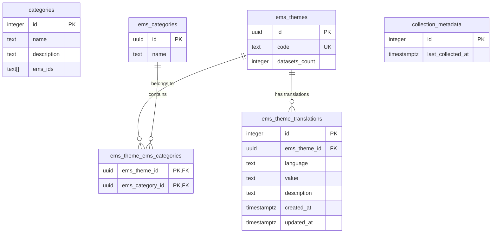

# Waypoint

Backend application for Waypoint example application.

* [Requirements](#requirements)
* [Config](#config)
* [Database](#database)
* [Running locally](#running-locally)
* [Generating server api](#generating-server-api)
* [Testing](#testing)
* [SBOM](#sbom)

# Requirements

* Go 1.26 or higher
* Docker

## Config

Example configuration in `config.env` file. For local development, it's possible to use `config.local.env` file in the root of the project instead of setting environment variables.

Supported environment variables:
* SERVER_ADDR - server address, default **:8081**
* ALLOWED_ORIGINS - Comma separated list of allowed origins for CORS.
* API_BASE_URL - URL for the Andmete teabevärav API, for example `https://andmed.eesti.ee/api`
* DB_USER - Database user
* DB_PASSWORD - Database password
* DB_HOST - Database host
* DB_PORT - Database port
* DB_NAME - Database name
* LOG_LEVEL - Log level: `debug`, `info`, `warn`, `error`. Default: **info**
* LOG_FORMAT - Log format: `text`, `json`, `otel`. Default: **otel**
* LOG_OUTPUT - Log output: `stdout`, `file`. Default: **stdout**
* LOG_PATH - Log file path, required when LOG_OUTPUT is set to `file`

## Endpoints

Server includes all public endpoints from the `openapi.yaml` spec under `/api` path. Additionally, there are internal endpoints for cluster health checks and metrics.

| Method | Endpoint | Description           |
|--------|----------|-----------------------|
| GET    | /health  | Health check endpoint |
| GET    | /metrics | Prometheus metrics    |

## Database

Database migrations are managed using [tern](https://github.com/jackc/tern/tree/master).

Database schema:



Running database migrations for development:
```shell
go install github.com/jackc/tern/v2@latest
tern code install setup/postgres/local --config setup/postgres/tern.conf
tern migrate --migrations db/migrations --config setup/postgres/tern.conf
```

Removing migrations:
```shell
tern migrate --migrations db/migrations --config setup/postgres/tern.conf --destination -1
```

To run the database migrations for production use the image built from the Dockerfile in the `db` directory.
Running the image requires mounting a config file (example in `setup/postgres/tern.conf`) and `TERN_CONFIG` environment variable pointing to the config file.

It's also possible to use the image for migrating a local database with docker run. Make sure the host value in the tern.conf is set correctly, for example `host.docker.internal` when using docker for mac.
```
docker run -it -v /path-to-project/setup/postgres/tern.conf:/migrations/tern.conf -e TERN_CONFIG=/migrations/tern.conf ghcr.io/entigolabs/waypoint-db:latest
```
It's also possible to validate that the currently applied schema is up to date by running the image with the `validate` command.

Database queries are written using [ksql](https://github.com/vingarcia/ksql) with [pgx](https://github.com/jackc/pgx) driver.

## Running locally

Steps to run the application locally:
1. Execute `docker compose up -d`
2. Run the database migrations with tern, look at the [Database migrations](#database) section for more information.
3. Create [config.local.env](#config) in project root and fill the missing values.
4. Run the application with `go run main.go` or by using other preferred method.

## Generating server api

Server api is generated using [oapi-codegen](https://github.com/oapi-codegen/oapi-codegen). Generation uses `openapi.yaml` spec document. Generated code is placed in the `api` package. Generation commands are in `generate.go` file.

Generating the server code:
```
go generate ./...
```

## Testing

Run tests locally:
```
make test
```

Run tests with JUnit XML output and HTML coverage report (used in CI, results written to `build/`):
```
make test-ci
```

## SBOM

Generate a CycloneDX software bill of materials (written to `build/bom.json`):
```
make sbom
```